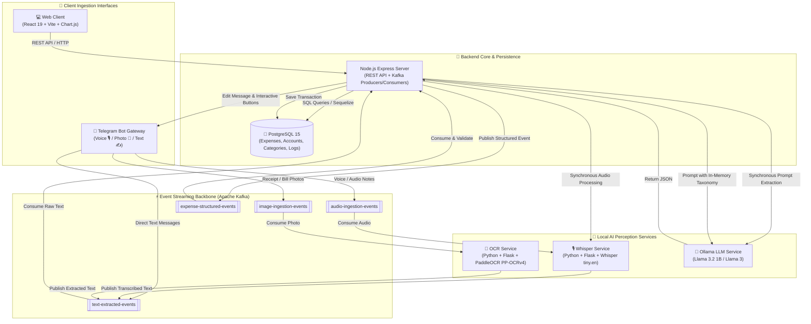
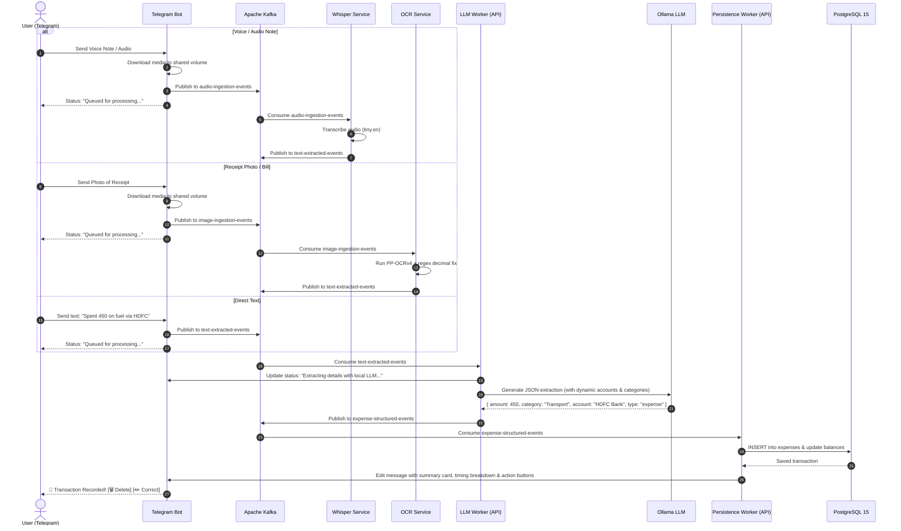
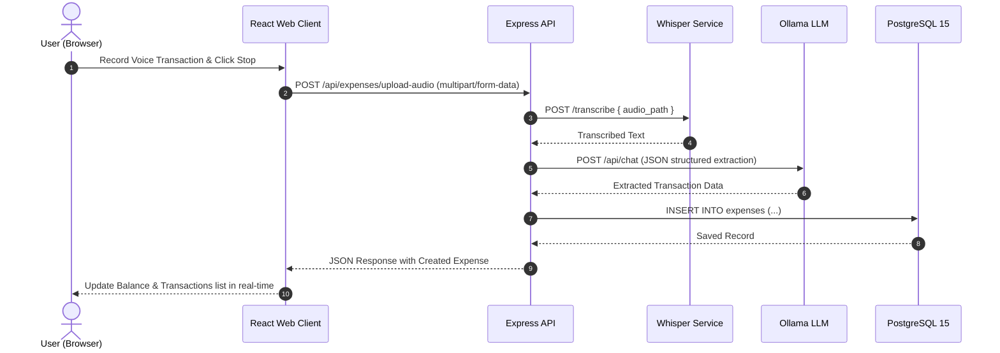
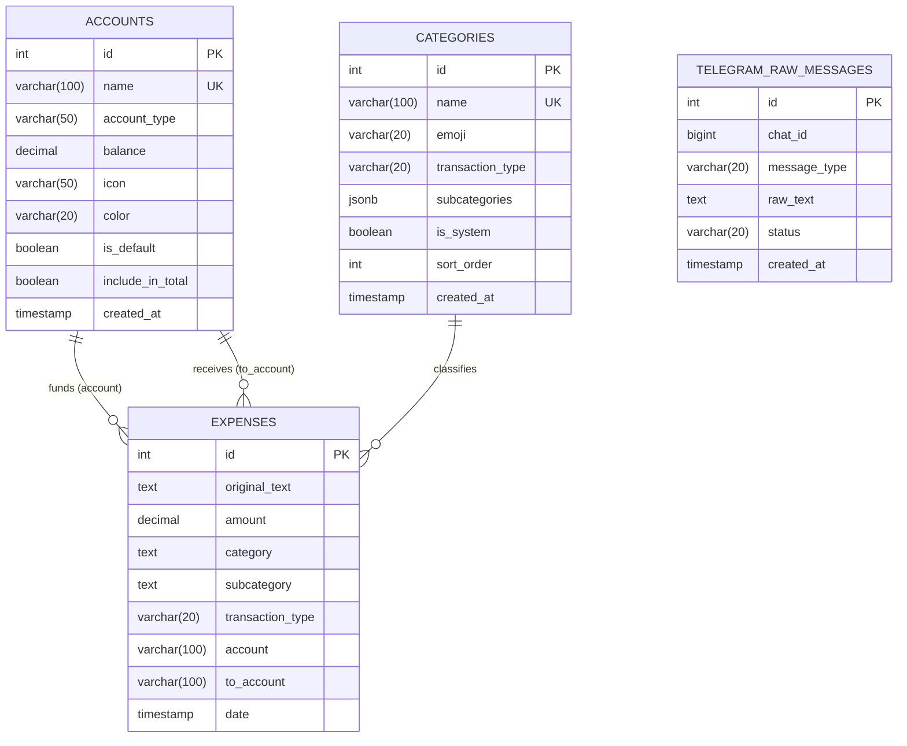

# 🎙️ SenseLedger - AI Multi-Modal Expense Tracker Architecture

SenseLedger is a full-stack, 100% local, multi-modal AI expense tracking platform designed for Web, Mobile, and Telegram interfaces. It allows users to record natural voice notes, snap photos of receipts/bills, or write shorthand text to automatically categorize and log financial transactions.

The system processes audio via **OpenAI Whisper**, extracts receipt text via **PaddleOCR**, parses structured parameters via a local LLM (**Ollama** with `llama3.2:1b`), streams ingestion events through **Apache Kafka**, and persists financial records in **PostgreSQL** with dynamic Indian Rupee (₹) balance computation.

---

## 🏛️ High-Level System Architecture

The application is containerized with Docker Compose into decoupled microservices communicating through synchronous REST APIs and an asynchronous Apache Kafka event bus:



---

## 🔄 Ingestion & Processing Pipelines

### 1. ⚡ Asynchronous Multi-Modal Telegram Pipeline (Event-Driven)



### 2. 💻 Synchronous Web Client Pipeline



---

## 📦 Microservices Breakdown

| Service | Container Name | Technology Stack | Ports | Responsibilities |
| :--- | :--- | :--- | :--- | :--- |
| **`client`** | `expense-client` | React 19, Vite, Chart.js, Lucide Icons, Nginx | `80:80` (prod)<br/>`5173:5173` (dev) | Single-page application, live voice recorder, multi-account cards, analytics breakdown charts, manual transaction CRUD. |
| **`api`** | `expense-api` | Node.js, Express, Sequelize, KafkaJS, `node-telegram-bot-api` | `9088:9088` | REST API gateway, Telegram bot service, Kafka LLM & Persistence consumers/producers, in-memory taxonomy caching. |
| **`whisper`** | `expense-whisper` | Python 3.10, Flask, OpenAI Whisper (`tiny.en`), `kafka-python` | `5000:5000` | In-memory speech-to-text model, HTTP `/transcribe` endpoint, Kafka consumer on `audio-ingestion-events`. |
| **`ocr`** | `expense-ocr` | Python 3.10, Flask, PaddleOCR 2.8.1 (`PP-OCRv4`), `kafka-python` | `5001:5001` | In-memory OCR model, decimal formatting heuristic, HTTP `/ocr` endpoint, Kafka consumer on `image-ingestion-events`. |
| **`ollama`** | `expense-ollama` | Ollama Engine (`llama3.2:1b` / `llama3`) | `11434:11434` | Local LLM inference engine providing JSON extraction from raw natural text. |
| **`kafka`** | `expense-kafka` | Apache Kafka (KRaft mode) | `9092:9092` | Distributed event streaming broker for asynchronous audio, image, text, and transaction pipelines. |
| **`kafka-ui`** | `expense-kafka-ui` | Provectus Kafka-UI | `8090:8080` (dev) | Web management dashboard for inspecting Kafka topics, partitions, consumer lag, and event payloads. |
| **`postgres`** | `expense-postgres` | PostgreSQL 15, Alpine | `6033:5432` | Relational persistent store for expenses, accounts, categories, and Telegram audit logs. |

---

## ⚡ Kafka Topics & Event Schemas

The Kafka backbone operates with 4 core topics:

### 1. `audio-ingestion-events`
Published when a user sends a voice note or audio file via Telegram.
```json
{
  "eventId": "evt_1724058123456_a1b2c",
  "source": "telegram",
  "messageType": "voice",
  "filePath": "/app/uploads/tg-voice-1724058123456.ogg",
  "chatId": 123456789,
  "statusMsgId": 42,
  "startedAt": 1724058123456,
  "timings": { "ingestionMs": 45 }
}
```

### 2. `image-ingestion-events`
Published when a user sends a receipt or invoice photo via Telegram.
```json
{
  "eventId": "evt_1724058123456_d4e5f",
  "source": "telegram",
  "messageType": "photo",
  "filePath": "/app/uploads/tg-photo-1724058123456.jpg",
  "chatId": 123456789,
  "statusMsgId": 43,
  "startedAt": 1724058123456,
  "timings": { "ingestionMs": 60 }
}
```

### 3. `text-extracted-events`
Published after Whisper speech-to-text, PaddleOCR, or directly from text notes.
```json
{
  "eventId": "evt_1724058123456_a1b2c",
  "source": "telegram",
  "messageType": "voice",
  "rawText": "Paid 350 rupees for lunch with HDFC bank",
  "chatId": 123456789,
  "statusMsgId": 42,
  "startedAt": 1724058123456,
  "timings": { "ingestionMs": 45, "whisperMs": 320 }
}
```

### 4. `expense-structured-events`
Published by the LLM extraction worker after JSON parameter extraction.
```json
{
  "eventId": "evt_1724058123456_a1b2c",
  "rawText": "Paid 350 rupees for lunch with HDFC bank",
  "extractedData": {
    "amount": 350,
    "category": "Food",
    "subcategory": "Lunch",
    "transaction_type": "expense",
    "account": "HDFC Bank",
    "to_account": null
  },
  "chatId": 123456789,
  "statusMsgId": 42,
  "startedAt": 1724058123456,
  "timings": { "ingestionMs": 45, "whisperMs": 320, "llmMs": 750 }
}
```

---

## 🗄️ Database Schema & Entity Relationships



### Dynamic Resolution & Caching Layer
- **In-Memory Caches**: On startup, `account.repository.js` and `category.repository.js` load active accounts and categories into in-memory maps.
- **Fuzzy Entity Resolution**: When LLM returns account aliases (e.g., `"hdfc"`, `"cash"`, `"credit card"`), the system matches them against existing configured accounts with default fallback.
- **Dynamic Computed Balances**: Account balances are dynamically aggregated by summing Initial Balance + Incomes + Incoming Transfers - Expenses - Outgoing Transfers.

---

## 🌐 API Reference

Base URL: `http://localhost:9088/api`

### 💸 Expenses (`/api/expenses`)
- `GET /api/expenses`: Retrieve all recorded transactions (ordered by date descending).
- `POST /api/expenses`: Manually create a new transaction (`amount`, `category`, `subcategory`, `account`, `to_account`, `transaction_type`).
- `POST /api/expenses/upload-audio`: Upload audio file (`multipart/form-data`) for synchronous Whisper + Ollama pipeline and immediate persistence.
- `PUT /api/expenses/:id`: Update existing transaction fields.
- `DELETE /api/expenses/:id`: Delete a transaction.

### 🎙️ Audio Processing (`/api/audio`)
- `POST /api/audio/process`: Transcribe audio file and optionally perform LLM extraction without writing to the database.

### 🏦 Accounts (`/api/accounts`)
- `GET /api/accounts`: Fetch all accounts with computed balances and transfer histories.
- `POST /api/accounts`: Create a new custom account (`name`, `account_type`, `balance`, `icon`, `color`, `include_in_total`).
- `PUT /api/accounts/:id`: Update account metadata and configuration.
- `DELETE /api/accounts/:id`: Delete account (expenses fallback to default account).
- `POST /api/accounts/transfer`: Record a transfer transaction between two accounts (`from_account`, `to_account`, `amount`).

### 🏷️ Categories (`/api/categories`)
- `GET /api/categories?type=expense|income`: Retrieve categories with nested subcategory JSON.
- `POST /api/categories`: Create a new category with custom emoji and subcategory arrays.
- `PUT /api/categories/:id`: Update category name, emoji, or subcategories.
- `DELETE /api/categories/:id`: Delete category.

### 🤖 Telegram Webhook (`/api/telegram`)
- `POST /api/telegram/webhook`: Webhook endpoint for production Telegram deployments (alternative to long-polling mode).

---

## 🤖 Telegram Bot Interactive Experience

- **Voice Notes & Audio**: Instant transcription via Whisper worker.
- **Receipts & Invoices**: Image text extraction via PaddleOCR worker.
- **Inline Actions**: Every transaction posted to Telegram includes interactive inline buttons:
  - `🗑️ Delete`: Instantly removes the transaction from PostgreSQL.
  - `✏️ Correct`: Sets pending conversation state, enabling natural language follow-up corrections (e.g. *"Change category to Dining and amount to 600"*).
- **Latency Telemetry**: Summary cards report precise pipeline duration breakdown:
  ```text
  💸 Transaction Recorded!
  Amount: -₹350.00
  Category: Food › Lunch
  Account: HDFC Bank
  Type: expense
  Date: 19 Aug 2026

  "Paid 350 rupees for lunch with HDFC bank"

  ⏱️ Processed in 1.12s (Whisper 0.32s · LLM 0.75s · DB 0.05s)
  ```

---

## 🚀 Running & Deploying

### Prerequisites
- Docker & Docker Compose
- Node.js 20+ (for host development)
- Python 3.10+ (for local worker debugging)

### 1. Environment Configuration
Copy `.env.example` to `.env` and fill in required secrets:
```bash
cp .env.example .env
```
Key variables:
```dotenv
PORT=9088
DB_HOST=postgres
DB_PORT=5432
DB_USER=expense_user
DB_PASSWORD=expense_password
DB_NAME=expense_db

KAFKA_BROKERS=kafka:9092
WHISPER_URL=http://whisper:5000/transcribe
OCR_URL=http://ocr:5001/ocr
OLLAMA_HOST=http://ollama:11434
OLLAMA_MODEL=llama3.2:1b

TELEGRAM_BOT_TOKEN=your_telegram_bot_token_here
```

### 2. Start Services
```bash
# Start all containers in background
docker compose up --build -d

# Check running status
docker compose ps

# Access Services:
# - Web UI:       http://localhost:80 (prod) or http://localhost:5173 (dev)
# - Backend API:  http://localhost:9088
# - Kafka UI:     http://localhost:8090
# - Whisper API:  http://localhost:5000
# - OCR API:      http://localhost:5001
# - Ollama API:   http://localhost:11434
```
