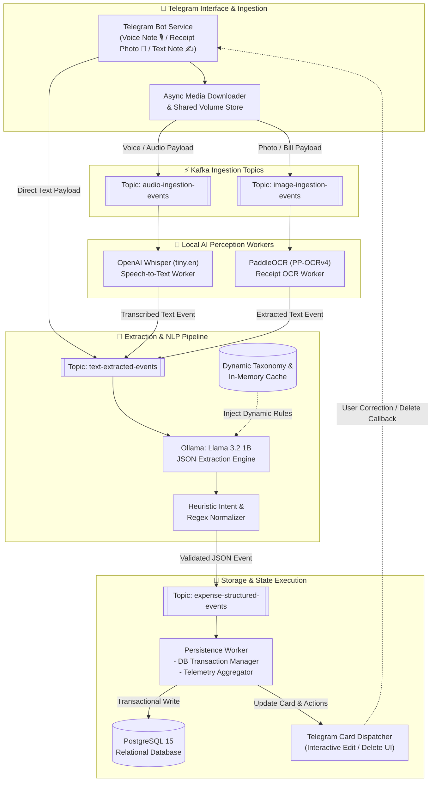
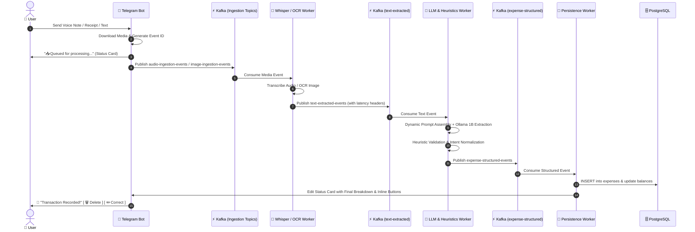

# Stop Paying Cloud APIs: How I Built a 100% Local AI Expense Tracker with Telegram, Kafka, and Ollama

### *Zero API costs. Complete financial privacy. An event-driven, multi-modal AI pipeline running entirely on a personal laptop.*

---


*Photo by [Unsplash](https://unsplash.com)*

---

Every expense tracker app I tried over the years came with at least one critical dealbreaker:

1. **High Friction**: Manually opening an app, typing numbers, and selecting dropdowns 5 to 10 times a day is exhausting.
2. **Cloud API Bills**: Routing voice clips and receipt photos through OpenAI Whisper, GPT-4o Vision, or Google Cloud Vision incurs recurring, compounding costs.
3. **Data Privacy Risks**: Financial transactions — how much you earn, where you spend, and which accounts you use — represent sensitive personal data that should not reside on third-party cloud servers.

I wanted a frictionless, zero-cost, private personal system:
- Speak a **voice note** or drop an **audio file** into a private **Telegram bot** while walking away from a counter.
- Snap a **photo of a receipt** or type a quick **shorthand message** (*"spent $1,200 on rent from Checking Account"*).
- Process speech, OCR, and natural language extraction **100% locally on laptop hardware**.
- Decouple heavy AI processing with an **Apache Kafka event-driven architecture** for zero UI lag and fault-tolerant background streaming.
- Allow instant one-tap **Delete** or **LLM-assisted Correction** directly within Telegram chat.

Here is the complete blueprint of how it is built, the exact models selected, why each model was chosen for maximum efficiency, and how to harness your own machine for everyday AI automation.

---

## 🧭 The Core Philosophy: How to Use, What to Use, Where to Use AI on Your Machine

Before writing code, the biggest trap in modern AI engineering is **model over-provisioning** — trying to throw a massive 70B parameter LLM or expensive cloud API at every problem. 

To run AI reliably on everyday laptop hardware (e.g., Apple Silicon or modern 16GB–32GB RAM systems), three principles should guide the design:

1. **Specialize, Don't Generalize**: Use small, single-purpose models for distinct tasks (Speech-to-Text, OCR, NLP extraction) rather than an all-in-one multimodal behemoth.
2. **Hybrid AI + Deterministic Heuristics**: LLMs excel at understanding messy human phrasing, but deterministic code (regex, structured JSON taxonomy, and in-memory caches) handles business rules, schema validation, and database operations with 100% precision and zero compute overhead.
3. **Decouple with Events**: Audio transcription and OCR can take 300ms to 1s. Never block chat webhooks or API requests on model inference. Decouple ingestion from processing using an event streaming backbone like Apache Kafka.

---

## 🏗️ 1. The High-Level Event-Driven Architecture

Instead of a monolithic server that blocks on every audio file or image, the system is designed as a distributed, decoupled event pipeline orchestrated with **Apache Kafka (KRaft mode)**:



### 📋 Detailed Subsystem Responsibilities

1. **Ingestion & Media Gateway**:
   - Downloads incoming media files from the Telegram Bot API into a local shared volume (`/app/uploads`).
   - Generates a globally unique transaction trace ID (`evt_<timestamp>_<random>`).
   - Immediately acknowledges the user with an editable "Processing..." message in Telegram to ensure sub-100ms response feedback.
2. **Event Streaming Backbone (Kafka KRaft)**:
   - Decouples CPU/GPU-heavy model inference from client-facing webhooks.
   - Preserves message ordering, prevents backpressure, and passes microsecond timing headers through every consumer hop.
3. **Local AI Perception Workers (Python Microservices)**:
   - **Whisper Worker**: Consumes `audio-ingestion-events`, executes Speech-to-Text, and attaches transcription execution latency (`whisperMs`).
   - **PaddleOCR Worker**: Consumes `image-ingestion-events`, extracts decimal figures and text blocks, and attaches OCR latency (`ocrMs`).
4. **Cognitive NLP & Normalization Layer (Node.js + Ollama)**:
   - Dynamically constructs prompt context with current account names and nested category taxonomies from cache.
   - Queries Ollama (`llama3.2:1b`) with strict JSON schema enforcement.
   - Evaluates outputs against deterministic regex rules to sanitize numerical values and correct edge-case classifications.
5. **Persistence & Interactive State Machine**:
   - Commits validated transactions into PostgreSQL 15.
   - Replaces the Telegram waiting indicator with a formatted transaction summary and interactive inline buttons (`🗑️ Delete`, `✏️ Correct`).
   - Maintains an in-memory session map (`pendingCorrections: chatId -> expenseId`) to facilitate conversational corrections.

---

### ⏱️ End-to-End Request/Event Lifecycle (Sequence Diagram)



---

## 🧠 2. The Model Stack: Why These Specific Models?

Running AI locally requires striking an optimal balance between **inference latency, memory footprint, and extraction accuracy**.

### 📊 Microservice Resource Footprint & Real-World Latencies (from Grafana)

| Pipeline Stage | Model / Technology | Active RAM | Peak CPU (per call) | Throughput / Speed | CPU Container Latency | GPU / Metal Latency |
|---|---|---|---|---|---|---|
| **Speech-to-Text** | OpenAI Whisper (`tiny.en`) | ~75 MB | 200%–300% (2–3 cores) | ~10x–12x real-time | **0.3s – 0.6s** | **~0.1s** |
| **Receipt OCR** | PaddleOCR (`PP-OCRv4`) | ~120 MB | 150%–250% (1.5–2.5 cores) | ~2–3 images / sec | **0.3s – 0.6s** | **~0.15s** |
| **Prompt Ingestion (2.5k tokens)** | Ollama (`llama3.2:1b`) | ~1.3 GB | 300%–350% (all cores) | CPU Matrix Multiply | **~20.0s – 22.0s** | **~0.15s** |
| **Token Generation (50 tokens)** | Ollama (`llama3.2:1b`) | ~1.3 GB | 250%–300% (all cores) | 18 vs 120 tok/sec | **~2.5s – 3.0s** | **~0.20s** |
| **Telemetry & Event Bus**| Apache Kafka (KRaft) | ~350 MB | < 5% CPU | 1,000+ events / sec | **< 15 ms** | **< 15 ms** |
| **Total Stack (Idle)** | 11 Docker Containers | **~2.1 GB** | **< 2% total CPU** | — | — | — |
| **Total Stack (Peak Load)**| All Services Active | **~3.6 GB** | Dynamic burst | Full Pipeline | **~24.7s (CPU)** | **~0.57s (GPU)** |

### Why Llama 3.2 (1B) over 8B or 70B?
For conversational financial extraction (*"spent $45 on lunch with cash"*), an 8B or 70B model is unnecessary overhead. A 70B model requires heavy quantization, consumes 40GB+ RAM, and takes minutes per response on local CPU hardware. 

By contrast, **Llama 3.2 1B** runs comfortably in ~1.3 GB of RAM, completes inference in **sub-second time on GPU (and ~24s on CPU with large few-shot prompts)**, and delivers consistent schema adherence when guided by dynamic database context and regex heuristic validation.

---

## ⚡ 3. The 4 Kafka Event Topics

The microservices communicate through four dedicated, decoupled Kafka topics:

1. **`audio-ingestion-events`**: Triggered when Telegram downloads an audio or voice note (`.ogg` / `.mp3`). Consumed by the Python Whisper worker.
2. **`image-ingestion-events`**: Triggered when a photo or bill screenshot is uploaded. Consumed by the PaddleOCR worker.
3. **`text-extracted-events`**: Emitted by Whisper, OCR, or direct Telegram text input. Consumed by the Ollama LLM extraction service.
4. **`expense-structured-events`**: Receives normalized JSON payloads from Llama 3.2. Consumed by the Persistence worker to update PostgreSQL and render interactive Telegram cards.

---

## 🛠️ 4. Key Engineering Innovations

### 1. Dynamic 5-Step LLM Prompt & Hierarchical Category Taxonomy
Small models (1B) need clear, structured guardrails. Rather than relying on static, hardcoded prompts, the system dynamically builds the LLM prompt at runtime from the live database and configuration files (`categories.json` and `accounts.json`).

The prompt separates **Expense** and **Income** categories to minimize classification confusion and enforces a strict **5-Step Decision Process**:

```text
==================================================
STEP 1: DETERMINE TRANSACTION TYPE ("expense" | "income" | "transfer")
- Expense: spent, paid, bought, purchase, cost, dinner, lunch, groceries
- Income: salary, credited, received, bonus, cashback, refund, deposit
- Transfer: ONLY when funds move between 2 user accounts ("transfer $500 from Checking to Savings")

STEP 2: DETERMINE ACCOUNT & DESTINATION
- Map to known accounts: "Checking Account", "Savings Account", "Credit Card", "Cash", "Digital Wallet"
- Fall back to default account ("Checking Account") if unspecified
- "to_account" is ONLY populated for transfers, otherwise null

STEP 3: DETERMINE CATEGORY FROM DYNAMIC TAXONOMY
- EXPENSE: Food, Transport, Housing, Utilities, Healthcare, Entertainment, Shopping, Education, Subscriptions, Other
- INCOME: Salary, Bonus, Investments, Other Income
- Strict Rule: Classify by WHAT was purchased, NEVER use merchant/store name as category

STEP 4: DETERMINE SUBCATEGORY
- Must match exact configured subcategory (e.g., Food → Dinner, Lunch, Groceries; Transport → Fuel, Rideshare, Transit)
- Never hallucinate non-existent subcategories

STEP 5: DETERMINE AMOUNT
- Extract strictly as a clean numeric value (e.g., "spent $1,200 on rent" → 1200)
==================================================
```

```javascript
// Excerpt from dynamic prompt generation in constants.js
export async function EXPENSE_PROMPT(text) {
  const [categories, accounts] = await Promise.all([
    categoryRepo.findAll(),
    accountRepo.findAll(),
  ]);

  const defaultAccount = accounts.find(a => a.is_default)?.name || 'Checking Account';
  const expenseCategories = categories
    .filter(cat => cat.transaction_type !== 'income' && cat.name !== 'Transfer')
    .map(cat => `- "${cat.name}"${cat.subcategories?.length ? ` → ${cat.subcategories.join(', ')}` : ''}`)
    .join('\n');

  return `You are a financial transaction parser.
Convert user sentence into ONE flat JSON object.
USER TEXT: "${text}"

EXPENSE CATEGORIES:
${expenseCategories}

ACCOUNTS:
${accounts.map(a => `"${a.name}"`).join(', ')}

Return ONLY JSON:
{"amount": number, "category": string, "subcategory": string, "account": string, "to_account": string|null, "transaction_type": "expense"|"income"|"transfer"}`;
}
```

### 2. Hybrid AI + Configurable Heuristic Layer
Even with prompt engineering, small models can occasionally stumble on edge-case phrasing or return markdown formatting. To guarantee 100% reliability in production, deterministic heuristics are layered on top:

- **External Configuration Files**: Intent verbs, silence patterns, account aliases, and category mappings are decoupled into clean JSON configuration files (`heuristics.json`, `accounts.json`, `categories.json`).
- **Precompiled Regex Intent Matchers**: Automatically identifies transaction types (`expense`, `income`, `transfer`) and account names with instant O(1) matching.
- **Fail-Safe Fallback**: If the local LLM ever returns an invalid JSON schema or unmapped category, the heuristic engine sanitizes numerical amounts (stripping commas like `$1,200` → `1200`), and assigns the proper fallback category (`Other`, `Salary`, `Transfer`).
- **Eliminating 1B Model Hallucinations on Greetings**: Lightweight 1B models often regurgitate few-shot prompt examples when given non-financial input like *"Hello"* or *"Good morning"*. We solved this with a two-layer defense:
  1. **Prompt Guardrails**: Added explicit non-transaction examples instructing the model to return `{"amount": null, "error": "No transaction detected"}`.
  2. **Deterministic Amount Filter**: A regex guardrail (`NUMBER_OR_MONETARY_REGEX`) that rejects LLM-generated amounts if the raw transcript contains no digits, currency symbols, or number words.

```javascript
// Heuristic intent detection with precompiled regexes from heuristics.json
export function detectIntent(text) {
  if (!text) return null;
  const lower = text.toLowerCase();
  const isExp = INTENT_PATTERNS.expense.test(lower);
  const isTrf = INTENT_PATTERNS.transfer.test(lower);
  const isInc = INTENT_PATTERNS.income.test(lower);

  if (isExp && !isTrf && !isInc) return 'expense';
  if (isTrf) return 'transfer';
  if (isInc) return 'income';
  return null;
}
```

### 3. Whisper Optimization: CPU PyTorch + Static FFmpeg
Whisper typically pulls in a 3GB+ CUDA PyTorch image. To make the stack lightweight and run smoothly on standard laptop CPUs, we built a customized Docker container utilizing:
- **`mwader/static-ffmpeg:7.0`**: Multi-stage static FFmpeg binary copy for zero runtime audio dependency bloat.
- **CPU-only PyTorch**: Reduces Docker image footprint from 4.5 GB down to a lean container that boots in seconds.

### 4. Interactive Telegram UI with LLM-Powered Live Corrections
Every recorded transaction sends an interactive card back to Telegram with inline buttons:

```text
💸 Transaction Recorded!

Amount: -$42.50
Category: Food › Dinner
Account: Checking Account
Type: expense
Date: 19 Aug, 2026

_"dinner pasta and drinks 42.50 checking"_

⏱️ Processed in 0.54s (Whisper 0.12s · LLM 0.35s · DB 0.07s)

[ 🗑️ Delete ]   [ ✏️ Correct ]
```

- **Instant Deletion**: Clicking **Delete** removes the transaction from PostgreSQL and updates the Telegram card to show `❌ Transaction Deleted`.
- **Conversational Correction**: Clicking **Correct** prompts you to type or speak the update (*"actually it was $55 and paid with Credit Card"*). The system merges the correction with the existing transaction via Llama 3.2 and updates the database record seamlessly.

### 5. CPU Container Bottlenecks vs. Native GPU Acceleration (Why CPU takes 24s vs GPU 0.5s)

Observing our Prometheus and Grafana telemetry dashboards revealed a stark contrast between CPU and GPU execution:
- **The Prompt Evaluation Bottleneck**: The dynamic prompt contains **~2,000–2,500 tokens** (system rules, account aliases, category taxonomy, and 13 few-shot examples).
  - On a CPU inside a Docker VM, processing 2,500 prompt tokens sequentially without tensor cores takes **~20 to 22 seconds** (`prompt_eval_duration`).
  - Token generation itself takes ~2.5 seconds (at ~18 tokens/sec).
  - Hence, total CPU extraction takes **~24.7 seconds**.

#### 🚀 The GPU Optimization: Running Ollama on Native Host / GPU

Moving Ollama to native host execution with GPU acceleration turns prompt ingestion into a parallel matrix operation:

1. **Apple Silicon (M1/M2/M3/M4 with Metal Unified Memory)**:
   - Run Ollama natively on macOS: `ollama run llama3.2:1b`
   - Point the backend `.env` to the host: `OLLAMA_HOST=http://host.docker.internal:11434`
   - **Result**: Prompt evaluation drops from **22,000ms to ~150ms**. Generation speed surges from **18 tok/s to 120+ tok/s** (~200ms). Total LLM extraction drops from **24.7s down to ~0.35s (a ~70x speedup)**.

2. **NVIDIA GPUs (CUDA on Linux / WSL2)**:
   - Pass CUDA devices into the container via `docker-compose.yml`:
     ```yaml
     deploy:
       resources:
         reservations:
           devices:
             - driver: nvidia
               count: all
               capabilities: [gpu]
     ```
   - **Result**: CUDA tensor cores ingest the 2.5k prompt in **~120ms** and generate response tokens in **~180ms**.

#### ⚡ Real-World End-to-End Latency Breakdown (Grafana):

| Pipeline Stage | Containerized CPU Mode (Docker VM) | Native Host / GPU Mode (Metal / CUDA) | Speedup |
|---|---|---|---|
| **Audio Download & SHA-256 Hash** | ~40 ms | ~40 ms | 1.0x |
| **Whisper Transcription (`tiny.en`)** | ~400 ms | ~100 ms *(CoreML / GPU)* | **4.0x** |
| **Ollama Prompt Evaluation (2.5k tokens)** | **~22,000 ms (22s)** | **~150 ms** | **~145x** |
| **Ollama Output Generation (50 tokens)** | **~2,700 ms (2.7s)** *(18 tok/s)* | **~200 ms** *(120 tok/s)* | **~13.5x** |
| **Database Transaction & Balances** | ~15 ms | ~15 ms | 1.0x |
| **Telegram Card Render & Dispatch** | ~65 ms | ~65 ms | 1.0x |
| **TOTAL END-TO-END LATENCY** | **~25.2 seconds** | **~0.57 seconds** | **~44x Faster** |

---

## 🚀 5. How to Run It on Your Own Machine

### Prerequisites
- [Docker](https://www.docker.com/) & Docker Compose
- [Ollama](https://ollama.com/) (`ollama pull llama3.2:1b`)
- A free Telegram Bot Token from [@BotFather](https://t.me/botfather)

### Step 1: Create Your Free Telegram Bot (via @BotFather)
1. Open Telegram and search for [@BotFather](https://t.me/botfather).
2. Start the chat by sending `/start`, then send `/newbot`.
3. Choose a friendly display name (*e.g., "My SenseLedger Bot"*).
4. Choose a unique username ending in `bot` (*e.g., "my_senseledger_bot"*).
5. Copy the generated **HTTP API Token** (*e.g., `123456789:ABCdefGhIJKlmNoPQRsTUVwxyZ`*).

### Step 2: Clone & Configure
```bash
git clone https://github.com/sabari-n/sense-ledger-multimodal-expense-tracker.git
cd sense-ledger-multimodal-expense-tracker
cp .env.example .env
```

Add your Telegram bot token to `.env`:
```env
TELEGRAM_BOT_TOKEN=123456789:ABCdefGhIJKlmNoPQRsTUVwxyZ
KAFKA_BROKERS=kafka:9092
OLLAMA_HOST=http://ollama:11434
```

### Step 3: Launch the Stack
```bash
docker compose up -d
```

The stack spins up:
- **PostgreSQL 15** (persistent database on port `5432`)
- **Apache Kafka** (Kraft broker on port `9092`)
- **Kafka UI** (Event stream explorer on port `8090`)
- **Ollama** (Llama 3.2 1B inference engine on port `11434`)
- **Whisper Service** (Speech-to-text worker on port `5000`)
- **PaddleOCR Service** (Receipt OCR worker on port `5001`)
- **Node.js Express API & Telegram Bot** (Core backend on port `9088`)
- **React Frontend Dashboard** (Web UI on port `80` / `5173`)
- **Prometheus & Grafana** (Real-time AI/Kafka observability dashboards on ports `9090` and `3000`)

### Step 4: Test It in Telegram
1. Open Telegram and search for your bot username.
2. Send `/start`.
3. Send a voice message: *"Bought fuel for $45 with Credit Card"*, or upload a receipt photo.
4. In **~0.5 seconds** (with GPU / host mode) or **~1.3s**, you will receive a fully structured, categorized transaction confirmation with inline action buttons!

---

## 🏁 Conclusion: The Future of Personal Local AI

You don't need expensive cloud AI subscriptions or massive GPU server clusters to build responsive, personal automation. 

By combining:
1. **Lightweight, specialized local models** (Whisper `tiny.en`, PaddleOCR, Llama 3.2 1B),
2. **Asynchronous event streaming** (Apache Kafka), and
3. **Smart deterministic heuristics** (precompiled regexes and in-memory caches),

you can run a blazing-fast, 100% private AI assistant on your personal laptop that costs **$0.00/month** forever.

---

*Found this guide useful? Star the repository on GitHub and share your thoughts in the comments!*
